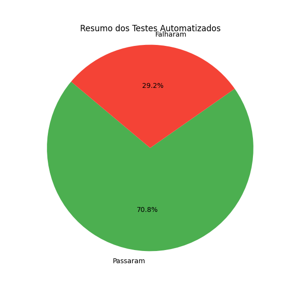

# ✅ Resumo da Execução dos Testes

📅 Data: 07/07/2025 às 19:40  
📦 Total de Testes: 24  
✅ Passaram: 17  
❌ Falharam: 7  
📊 Sucesso: 70.8%

---

## 🔺 Prioridade: Alta

✅ CT001 - Registro de usuário com sucesso

✅ CT002 - Registro com e-mail duplicado

✅ CT003 - Registro com e-mail inválido

✅ CT004 - Registro com senha inválida

✅ CT005 - Login com sucesso

❌ CT006 - Login com senha incorreta

✅ CT021 - CRUD de filme por Admin (sucesso)

✅ CT024 - CRUD de teatro por Admin (sucesso)

❌ CT036 - Editar dados de um usuário para promovê-lo à admin

✅ CT039 - Bloqueio de acesso aos endpoints de usuários por usuário comum

✅ CT018 - Fluxo de reserva com sucesso

✅ CT020 - Histórico de reservas

---

## 🟡 Prioridade: Média

❌ CT007 - Login com email não cadastrado

✅ CT022 - Validação de payload inválido ao criar filme

❌ CT033 - Atualizar status de uma reserva (Admin)

✅ CT028 - Criar nova sessão de filme por Admin

✅ CT025 - Validação de payload inválido ao criar teatro

❌ CT027 - Bloqueio ao tentar excluir teatro com sessões ativas

❌ CT037 - Excluir usuário sem reservas como admin

✅ CT015 - Listagem de filmes com filtros e paginação

❌ CT016 - Detalhes de filme com sessões

✅ CT019 - Tentar reservar assentos ocupados

---

## 🔻 Prioridade: Baixa

✅ CT023 - Bloqueio de CRUD de filme por usuário comum

✅ CT026 - Bloqueio de CRUD de teatro por usuário comum

---

